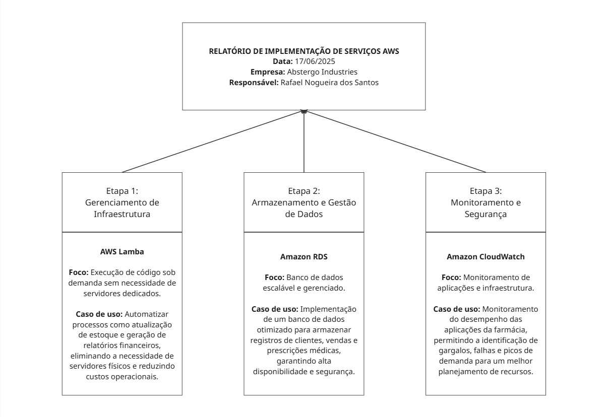

# RELATÓRIO DE IMPLEMENTAÇÃO DE SERVIÇOS AWS
Data: 17/06/2025

Empresa: Abstergo Industries 

Responsável: Rafael Nogueira dos Santos

## Introdução
Este relatório documenta a implementação de serviços AWS na empresa *Abstergo Industries*, visando a redução de custos operacionais e melhorias na eficiência dos processos. O objetivo foi selecionar três serviços estratégicos para otimizar o funcionamento da farmácia e aprimorar sua infraestrutura tecnológica.

## Descrição do Projeto
O projeto foi estruturado em três etapas, cada uma focada em uma solução específica:

### Etapa 1: Gerenciamento de Infraestrutura
- **AWS Lambda**  
  - *Foco:* Execução de código sob demanda sem necessidade de servidores dedicados.  
  - *Caso de uso:* Automatizar processos como atualização de estoque e geração de relatórios financeiros, eliminando a necessidade de servidores físicos e reduzindo custos operacionais.

### Etapa 2: Armazenamento e Gestão de Dados
- **Amazon RDS (Relational Database Service)**  
  - *Foco:* Banco de dados escalável e gerenciado.  
  - *Caso de uso:* Implementação de um banco de dados otimizado para armazenar registros de clientes, vendas e prescrições médicas, garantindo alta disponibilidade e segurança.

### Etapa 3: Monitoramento e Segurança
- **Amazon CloudWatch**  
  - *Foco:* Monitoramento de aplicações e infraestrutura.  
  - *Caso de uso:* Monitoramento do desempenho das aplicações da farmácia, permitindo a identificação de gargalos, falhas e picos de demanda para um melhor planejamento de recursos.

## Conclusão
A implementação dos serviços AWS na *Abstergo Industries* permitiu uma significativa redução de custos operacionais, eliminando a necessidade de manutenção de servidores físicos e melhorando a eficiência dos processos. A utilização de ferramentas de monitoramento e banco de dados escalável contribui para uma operação mais ágil e segura.

Recomenda-se a continuidade do uso dessas tecnologias, bem como a busca por novas soluções inovadoras para aprimorar ainda mais o desempenho da farmácia.

## Anexos
- Documentação das APIs utilizadas.
- Manuais técnicos para integração dos serviços AWS.
- Relatório de custos antes e depois da implementação.

Assinatura do Responsável pelo Projeto:

Rafael Nogueira dos Santos

## Diagrama
Ferramenta utilizada: [Miro](https://miro.com/)

